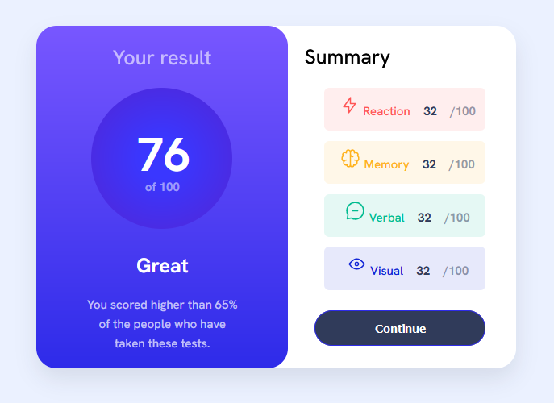
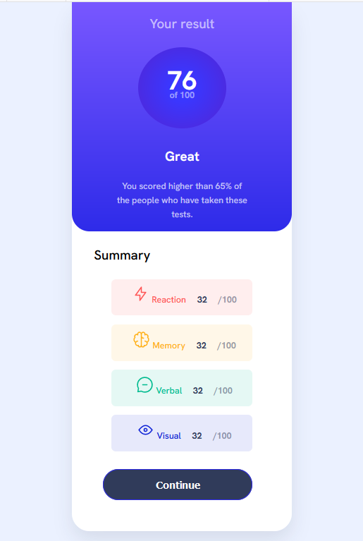

# Frontend Mentor - Results summary component solution

This is a solution to the [Results summary component challenge on Frontend Mentor](https://www.frontendmentor.io/challenges/results-summary-component-CE_K6s0maV). Frontend Mentor challenges help you improve your coding skills by building realistic projects.

## Table of contents

- [Overview](#overview)
  - [The challenge](#the-challenge)
  - [Screenshot](#screenshot)
  - [Links](#links)
- [My process](#my-process)
  - [Built with](#built-with)
  - [What I learned](#what-i-learned)
  - [Useful resources](#useful-resources)
- [Author](#author)

## Overview

### The challenge

Users should be able to:

- View the optimal layout for the interface depending on their device's screen size
- See hover and focus states for all interactive elements on the page

### Screenshot

A screenshot from the desktop and mobile version of the app.

Desktop version:



Mobile version:


### Links

- Solution URL: [Github](https://github.com/elic4vet/results-component)
- Live Site URL: [Netlify](https://results-summary23.netlify.app/)

## My process

### Built with

- Semantic HTML5 markup
- CSS custom properties
- Flexbox
- CSS Grid
- Mobile-first workflow

### What I learned

I learned a lot during this coding exercice. I learned how to use CSS Grid and Flexbox to create a responsive layout. I also learned how to use CSS variables to make the code more readable and easier to maintain. I also learned how to use the CSS pseudo-class :hover to create a better user experience. I managed to refresh once again my knowledge about flexbox and found a way to center my container without effection the two different content sides. Finally, i learned a lot about opacity and how to apply in a more efficient way so that the content is still readable. This last part wasted a lot of my time but i'm glad i managed to find a solution. Last but not least, i worked on the media queries and managed to fix quick enough the mobile version of the app. But it took me a little bit longer to fix the tablet version. I used two different media queries to make sure the app was responsive on all devices.

```html
<h1>Some HTML code I'm proud of</h1>
<div class="container">
  <div class="card centered"></div>
</div>
```

```css
--red-opac: hsla(0, 100%, 67%, 0.1);
--yellow-opac: hsla(39, 100%, 56%, 0.1);
```

```css
.proud-of-this-css {
  --gradient-primary: linear-gradient(#7857ff 0%, #2e2be9 100%);
}
```

### Useful resources

- [CSS Grid Layout](https://developer.mozilla.org/en-US/docs/Web/CSS/CSS_Grid_Layout) - This helped me understand CSS Grid. I'd recommend it to anyone still learning this concept.

- [CSS Flexbox](https://developer.mozilla.org/en-US/docs/Web/CSS/CSS_Flexible_Box_Layout/Basic_Concepts_of_Flexbox) - This helped me understand CSS Flexbox. I'd recommend it to anyone still learning this concept.

- [CSS Variables](https://developer.mozilla.org/en-US/docs/Web/CSS/Using_CSS_custom_properties) - This helped me understand CSS Variables. I'd recommend it to anyone still learning this concept.

- [CSS Pseudo-classes](https://developer.mozilla.org/en-US/docs/Web/CSS/Pseudo-classes) - This helped me understand CSS Pseudo-classes. I'd recommend it to anyone still learning this concept.

- [Grid template columns ](https://developer.mozilla.org/en-US/docs/Web/CSS/grid-template-columns) - This is an amazing article which helped me finally understand grid template columns. I'd recommend it to anyone still learning this concept.

- [A Complete Guide to Flexbox](https://css-tricks.com/snippets/css/a-guide-to-flexbox/) - This helped me understand flexbox. I'd recommend it to anyone still learning this concept.

## Author

- Website - [Elisabeth Erkekoglou ](https://www.linkedin.com/in/eerkekoglou/)
- Frontend Mentor - [@elic4vet](https://www.frontendmentor.io/profile/elic4vet)
- Instagram - [@elisa.codes23](https://www.instagram.com/elisa.codes23/)
